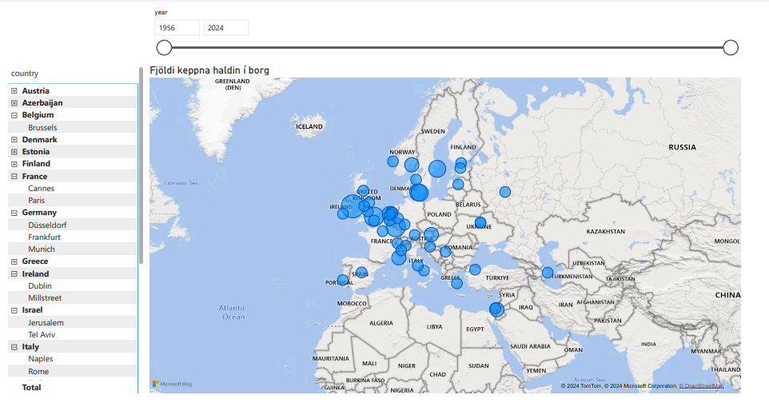
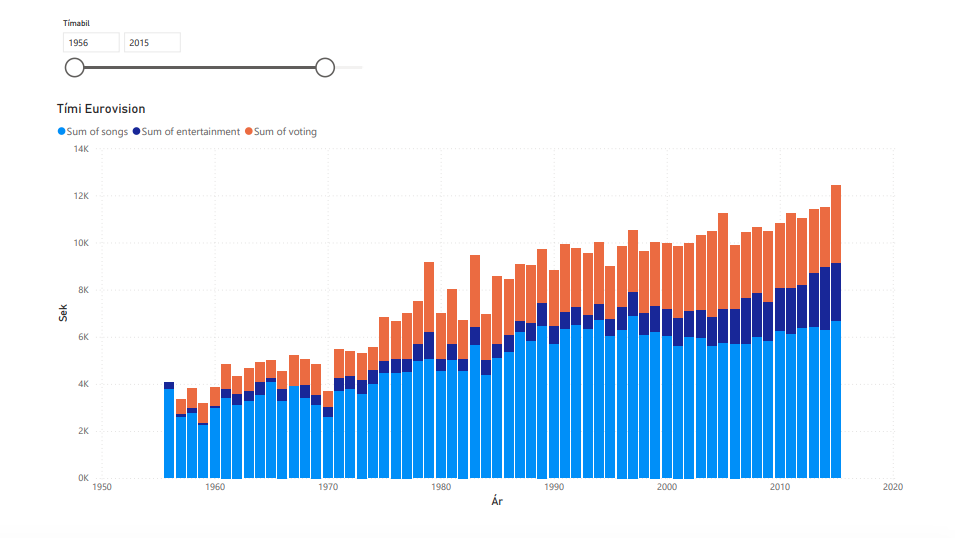
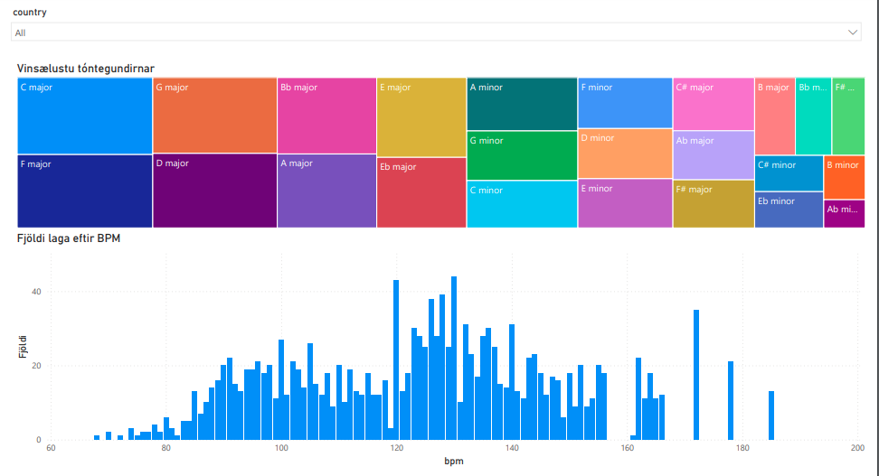
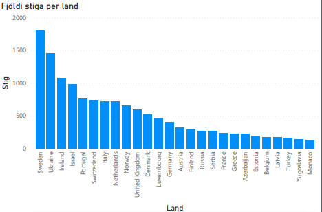

# **1. Verkefnalýsing**

Verkefnið fól í sér að útbúa og hanna mælaborð sem lýsti mismunandi þáttum evrópsku söngvakeppninnar Eurovision líkt
og tóntegundum, takti (bpm), lengd atriða og velgengni. Þá var kafað dýpra í velgengni Svíþjóðar annars vegar og Íslands
hins vegar yfir 20 ára tímabil (árnum 2004-2024) og borið þau saman þar sem þau taka keppninni hvað alvarlegast.
Leitað var að gagnagrunnum með nytsamlegum upplýsingum á netinu sem voru síðan skrapaðar og parse-aðar með gerð
reglulegra segða (regex), breyttar í CSV skrár en einnig var unnið gagnagrunna í Postgres sem notaðir voru við
gerð mælaborðsins í Power BI.

# **2. Lýsing á gagnaöflun – Hvaðan komu gögnin og hvernig voru þau fengin?**

Gögnin voru sótt af síðunni: https://eschome.net/index.html.
Síðan eru háð þýskum höfundarrétti (Markus Flecht) og er niðurhal af þessari síðu eingöngu leyfð til einkarekinna,
óviðskiptalegra nota.
Einnig voru gögn sótt af Github: https://github.com/josago97/EurovisionDataset  (tone og bpm)
Heimilt er að vinna með gögnin þ.e. nota, afrita, breyta, sameina, birta, dreifa samkvæmt leyfisskilmála.

Fyrir flesta gagnagrunna, var vefslóðin afrituð og sett inn í tiltekinn kóðabút sem gerður var í VSCode þar sem gögnin
breyttust í CSV skrá. Engar áskoranir tengdust gagnaöfluninni, gekk mjög smurt fyrir sig.
Meiri áskorun fylgdi gagnagrunnum sem voru unnir í Postgres þar sem þurfti að tengjast gagnagrunninum, útbúa töflur og
skrifa inní þær. Einnig þurfti að útbúa utanaðkomandi lykla (foreign key) sem gegna mikilvægu hlutverki í að viðhalda
gagnatengslum milli taflna.

Notast var við Power BI til að vinna með gögnin, og því var Power BI hlaðið niður með neðantöldum skrefum:

**Windows:**

1. Fyrst þarf að download SQLite ODBC 64 bits (ekki 32 bits) inn á tölvuna
2. Opna ODBC, smella á Add…
3. Velja SQlite3 ODBC Driver
4. Velja skrána isfolkid.db (sem var búið að hlaða niður frá Github frá sqlite verkefninu)
5. Opna Power BI
6. Búa til nýtt report
7. Ýta á Get data → more → ODBC
8. Þá ætti skráin að birtast, ýta á Windows (ekki vera inná Database) og ýta á að halda áfram
9. Þá opnast Navigator og hakað í þær töflur sem á að nota við gerð grafa

**macOS:**

Þar sem Power BI er microsoft forrit þá er ekki hægt að nota það á sama máta og með windows stýrikerfi. Einfaldasta
leiðin er að nota vefútgáfun: app.powerbi.com
Þeir sem er í háskólanum geta nýtt sér þessa leið í gegnum háskóla office pakkann. Þar er hægt að opna skrár sem hafa
verið hlaðnar niður í tölvuna og hægt að vinna í þeim.

Einnig þarf að hlaða niður **Docker** til að skoða töflur í Postgres.

1. Fylgja þessari slóð: https://www.docker.com/
2. Ýta á Download Docker Desktop og velja þar gerð tölvu sem verið er að nota
3. Skrifa í Terminal: docker run --name some-postgres -e POSTGRES_PASSWORD=mysecretpassword -p 5432:5432 -d postgres

# **3. Gagnavinnsla – Hvernig voru gögnin meðhöndluð?**

Eins og áður kom fram var gerður mismunandi kóði fyrir hvern gagnagrunn (töflu) sem sótt var af síðunni þar sem gögnin
voru sett upp á ólíkan hátt; annars vegar voru gögnin sótt með venjulegri get-fyrirspurn og hins vegar með
post-fyrirspurn með breytum. Það var lítil áskorun.
Reglulegar segðir (regex) voru gerðar til að hreinsa og skrapa upplýsingarnar á síðunni inn á Regex101. Unnið var með
CSV skrárnar inn í Power BI þar sem mælaborðið var hannað.
Þegar gögnin voru sótt af GitHub þá var textinn í formi JSON eða CSV. Hann var parse-aður til þess að koma því í pandas
DataFrame. Þegar því var lokið var síðan sótt viðeigandi dálka frá DataFrame-inu áður en því var loks vistað í CSV skrá.

Sum gögn voru vistuð í Postgres gagnagrunni í töfluformi í stað þess að vista þær sem CSV skrár en eini munurinn á í
hvernig þeir voru vistaðir. Einnig voru töflurnar í Postgres tengdar með lyklum (foreign key) til að tryggja samræmi
milli gagna.

# **4. Markverðustu niðurstöður – Hverjar voru helstu niðurstöður?**

Ýmsar áhugaverðar niðurstöður komu í ljós við gerð mælaborðsins. Þar má meðal annars sjá hvernig uppröðun atriða getur
haft áhrif á velgengni landa í keppninni; best er að vera sextándi í röðinni eða seinna. Svíþjóð og Írland hafa unnið
oftast eða sjö sinnum hvor, flest lög eru í Dúr og eru 120-130 bpm sem gefur til kynna að flest lög eru hress og
flokkast sem popp-tónlist eða diskó lög. Einnig voru stig Íslands borin saman við Svíþjóðar og kom þá í ljós að Ísland
gefur Svíþjóð flest sín stig en Ísland er ekki nema númer 10 hjá Svíþjóð. Annars eiga Ísland og Svíþjóð það sameiginlegt
að gefa og fá flest sín stig frá Norðurlöndunum.

# **5. Nánari útskýring á gröfum mælaborðsins**

Í gagnvirka kortinu hér fyrir neðan *(graf 1)* má sjá rennislá sem segir til um það tímabil sem notandi vill kanna. Þá
birtist til hliðar listi af öllum þeim löndum sem héldu keppnina á þessu tiltekna tímabili. Staðsetning keppnanna síast
síðan inná kortið og hægt er að sjá fjölda þeirra skipta sem keppnin hefur verið haldin í hverju landi með því að sveima
yfir það land sem maður vill kanna.

Grafið að neðan *(graf 2)* sýnir tímann sem fer í flutning á lögum (ljósblár), skemmtiatriðum (dökkblár) og kosningum
(appelsínugulur) yfir árin. Þetta graf er gagnvirkt þar sem hægt er að velja ákveðið tímabil sem notandinn vill skoða
með rennislánni. Áhugavert er að sjá að í gegnum árin, fer meiri tími í bæði skemmtiatriði og kosningar, í kjölfarið
lengist lengd keppninnar.
Eftir 2000 sést að aukin áhersla hefur verið í að fjölga skemmtiatriðum, en tíminn sem fer í skemmtiatriði er nú mun
meiri en áður á 20.öld.

    
     
    <em>Graf 1: Sýnir staðsetningu keppna.</em>

    
     
    <em>Graf 2: Lengd Eurovision frá upphafi.</em>

Fróðlegt var að sjá út frá *grafi 3*, sem sjá má hér að neðan, hversu ólík lög eru send í keppnina þar sem mikil
dreifing
er á takti (bpm = beats per minute). Grafið er gagnvirkt þannig hægt er að velja land í kassanum “Country” og birtast þá
tóntegundir laga þeirra landa sem er valið.
Einnig sést að vinsælt er að senda lög í dúr frekar en í moll (þar sem kassarnir fyrir dúr eru stærri). Það kemur ekki á
óvart þar sem dúr er oft talinn vera glaðlegri og lætur fólki líða betur. Á grafinu sést að C-dúr, F-dúr, G-dúr og D-dúr
eru vinsælustu dúr tóntegundirnar en A-moll, G-moll og C-moll vinsælustu moll tóntegundirnar.

Algengast er að lönd sendi inn lög með bpm 120 og 130 sem gefur til kynna að lögin eru oft popp-tónlist eða diskó-lög.
Einnig sést talsvert um róleg lög eða ballöður með bpm milli 70-100. Áhugavert er að sjá að 69 lög hafa verið með bpm
yfir 69 sem myndi teljast til þungarokks eða mjög hraðra tekknólaga.

    
     
    <em>Graf 3: Sýnir samhengi á milli bpm hjá lögum og tóntegunda.</em>

Hér að neðan má sjá *graf 4* sem lýsir sambandi uppröðun atriða (x-ás) og fjölda sigra (y-ás). Grafið sýnir númer þess
atriðis sem vann keppnina, þ.e. röðina sem það kom fram í á sviðinu. Ef landið sem vann var númer 12 í röðinni, þá er
gildið á grafinu 12. *Graf 5* sýnir eins samband milli uppröðunar, en í stað sigra þá tapa. Sjá má að flest lönd sem
hafa
unnið, hafa verið sautjánda atriðið upp á svið (7 talsins). Á hinn bóginn hafa flest lönd tapað sem hafa verið þrettándu
upp á svið (8 lönd). Skemmtilegt að sjá á fyrra grafinu (fjöldi sigra að því fyrr sem löndin koma fram á svið, því
sjaldnar vinnur það. Það gæti stutt þá kenningu að áhorfendur eigi það til að gleyma þeim atriðum sem koma fyrst á svið.
Á seinna grafinu (fjöldi tapa) má sjá að eftir þrettánda atriði, minnka líkurnar talsvert á því að tapa. Atriði sem eru
um miðja keppni eru, samkvæmt grafinu, líklegri til taps. Því er líklegt að stjórnendur vilji dreifa sigurstranglegum
atriðum jafnt yfir keppnina.

    
     
    <em>Graf 4: Samband uppröðunar og fjöldi sigra.</em>

    
     
    <em>Graf 5: Samband uppröðunar og fjölda tapa.</em>

*Graf 6*, sýnir samanlagðan stigafjölda siguratriða (y-ás) eftir löndum (x-ás). Það kemur ef til vill ekki mörgum á
óvart að sjá Svíþjóð þar sem hún er ein mesta popp- og Eurovision þjóð. Það gæti þó komið mörgum á óvart að Írland sé
þar á meðal þar sem þeim hefur ekki gengið sérlega vel seinustu ár og unnu keppnina seinast árið 1996.
Fróðlegt er að sjá á stöplaritinu, hvernig stigagjöfin hefur breyst seinustu ár. Þar sést að Úkraína hefur samanlagt
fengið heil 368 fleiri stig en Írland, þrátt fyrir að hafa unnið keppnina aðeins þrisvar sinnum. Það gæti orsakast vegna
breytingar á stigagjöf. Úkraína hefur unnið keppnina tvisvar sinnum nýlega, eftir að stigagjöfin breyttist; dómara- og
símaatkvæði eru talin í sitthvoru lagi og því möguleiki á að fá fleiri stig en áður. Einnig hafa lönd bæst við keppnina
á milli ára og því eru fleiri stig í boði nú en áður fyrr (á hápunkti Írlands).

    
     
    <em>Graf 6: Sýnir samanlagðan stigafjölda siguratriða eftir löndum.</em>

Hér að neðan eru tvö gröf sem sýna annars vegar stigin sem Ísland hefur gefið frá sér í keppninni *(graf 7)* og annars
vegar stigin sem Svíþjóð hefur gefið *(graf 8)*. Kemur í ljós að bæði Ísland og Svíþjóð gefa atkvæði sín helst til
Norðurlandana. Það kemur ef til vill ekki á óvart þar sem nágrannalönd styðja oft hvort annað í keppninni. Þó er mjög
áhugavert að sjá að Ísland hefur gefið Tékklandi stig við hvert einasta tækifæri, það má sjá á bláu súlunni sem stendur
fyrir sum of voting not null (%) eða hlutfall þess að gefa stig sem er ekki 0. Sjá má að Svíþjóð er í miklu uppáhaldi
hjá Íslendingum en það sama gildir ekki um viðhorf Svía á Íslandi í keppninni þar sem Ísland er 10.landið á listanum.
Svíþjóð hefur gefið Noregi flest sín stig en hlutfallslega mest til Ástralíu þar sem bláa súlan er 100%.

    
     
    <em>Graf 7: Stigin sem Ísland gefur öðrum löndum.</em>

    
     
    <em>Graf 8: Stigin sem Svíþjóð gefur öðrum löndum.</em>

Sama gildir með stigin sem Ísland og Svíþjóð fá frá öðrum löndum sem sjá má á grafi 9 og grafi 10 hér að neðan. Flest
stig fást frá Norðurlöndunum; Finnlandi, Noregi og Danmörku. Gaman er að sjá að Ísland og Svíþjóð eru í fjórða sæti hjá
hvort öðru.

    
     
    <em>Graf 9: Stigin sem Ísland fær frá öðrum löndum.</em>

    
     
    <em>Graf 10: Stigin sem Svíþjóð fær frá öðrum löndum.</em>

# **6. Mælaborðið – Hvar var það gert og hver var tilgangur þess?**

Tilgangur þessa mælaborðs var annars vegar að sjá sjónrænt þróun keppninnar; fjöldi keppanda, áhorf, kosningar og
vinsældir og hins vegar muninn á velgengni Svíþjóð og Íslandi í söngvakeppninni. Hlaðað var niður CSV skrám af Github:
Upplysingaverkfraedi/capstone-riverlands en einnig styður Power BI við Postgres svo það var ekki vandamál að fá
töflurnar upp þaðan.
Unnið var með skrárnar í Power BI þar sem þær eru mjög aðgengilegar og gott að vinna með slík gögn. Auðvelt var að draga
dálka úr CSV skránum (sem birtust á töfluformi) inn í alls kyns gröf sem x-ás og y-ás. Þó þurfti að hreinsa út gögn sem
hafði null breytur og gaf því villandi mynd upp á grafi. Þá var farið í transform data og valið filter nulls, við
dálkinn þar sem hreinsa þurfti út núll breyturnar. Hægt er að hafa nokkur gröf á hverri síðu og sýnir Power BI hvernig
gröfin geta tengst og haft áhrif á hvort annað sem gerir mælaborð inni í Power BI einstaklega notendavænt. Hægt er að
skoða mælaborðið inná github (ýta á mælaborð og view raw).

# **7. Tengsl við námsefnið**

- Gerðar voru **segðir (regex):** Til að lesa og laga texta fyrir flesta gagnagrunna af síðu á netinu. Sem dæmi: URL =
  "https://eschome.net/databaseoutput419.php"
  

  Þá var notast við Regex101.com og glósuheftið frá Helgu til að vinna segðirnar.

- **Skrapað gögn:** Sem má sjá á öllum kóðum í VSCode. Það var gert til að safna upplýsingum sem eru aðgengilegar á
  vefsíðum og eru ekki í fyrirliggjandi gagnagrunni.

- **Parse-a gögn:** Tókum gögn á netinu og unnum með þau. Umbreyttum úr einu formi í annað. Sem dæmi notuðumst við
  regexa og gerðum csv skrár.

- Gagnagrunnum var breytt í **CSV skrár**. Sem dæmi: df = pd.DataFrame(values)
  

  Einnig má sjá hvernig dálkar fengu nafn með “header” svo gögnin væru skýrari og auðlesanlegri.

- Notast var við **Postgres** gagnagrunn: Gögn voru sett í Postgres gagnagrunn með kóða og þar var notast við SQL.

Því má segja að allar tengingar við námsefnið, sem kenndar voru á námskeiðinu, voru nýttar á einhvern hátt í verkefninu.

# **8. Lokaorð**

Mælaborðið er öflugt verkfæri til að skoða gögnin á sjónrænan hátt, og veitir bæði áhugaverðar upplýsingar og nýja sýn á
gögn eins og í þessu tilfelli Eurovision. Power BI reyndist vera frábært verkfæri sem er auðvelt í notkun.
Ástæðan af hverju Eurovision varð fyrir valinu, er því allir teymismeðlimir eru miklir tónlistarunnendur og hafa fylgst
með keppnninni síðan þeir muna eftir sér. Þetta var því kjörið tækifæri til að sjá tölfræðina í kringum keppnina sjálfa.
Gröfin í mælaborðinu voru skýr og gagnvirk og lýstu tilgangi verkefnisins vel þar sem það gaf heildarsýn á stigagjöf,
vinsældir laga (hvað varðar takt og tóntegund), samanburð milli Íslands og Svíþjóðar og hvernig keppnin hefur þróast
hvað varðar uppsetningu og lengd atriða í gegnum tíðina. 
